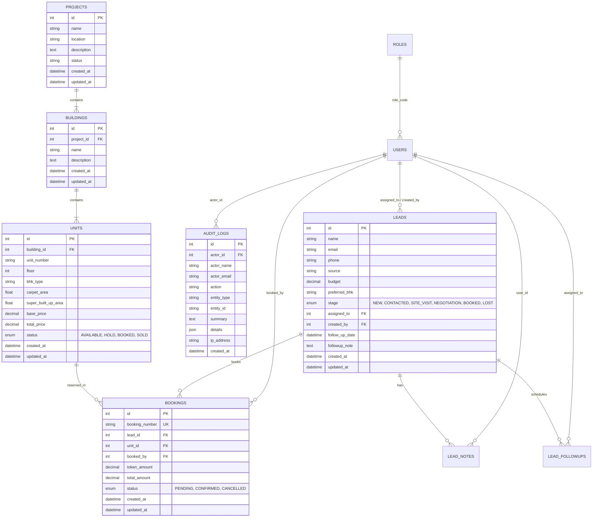

# 🗄️ Real Estate CRM – Database & API Specification Overview

> **Master Architecture Reference**: Detailed database schema dictionary, entity relationship diagram (ERD), constraints, indexing strategy, and full REST API endpoint specifications for the Real Estate CRM platform.

---

## 📑 Table of Contents
1. [System Architecture Standards](#1-system-architecture-standards)
2. [Database Architecture & Entity Relationships](#2-database-architecture--entity-relationships)
   - [Database Technology & Engine](#database-technology--engine)
   - [Entity-Relationship Diagram (ERD)](#entity-relationship-diagram-erd)
   - [Data Dictionary & Table Schemas](#data-dictionary--table-schemas)
   - [Indexes, Foreign Keys & Constraints](#indexes-foreign-keys--constraints)
3. [REST API Architecture & Protocol](#3-rest-api-architecture--protocol)
   - [Base URL & Protocol](#base-url--protocol)
   - [Standard Request & Response Envelope](#standard-request--response-envelope)
   - [Error Handling & HTTP Status Codes](#error-handling--http-status-codes)
4. [Complete API Endpoints Reference](#4-complete-api-endpoints-reference)
   - [1. Authentication & Session (`/api/v1/auth`)](#1-authentication--session-apiv1auth)
   - [2. Leads Pipeline & Interactions (`/api/v1/leads`)](#2-leads-pipeline--interactions-apiv1leads)
   - [3. Projects & Towers (`/api/v1/projects`)](#3-projects--towers-apiv1projects)
   - [4. Units Inventory Matrix (`/api/v1/units`)](#4-units-inventory-matrix-apiv1units)
   - [5. Bookings & Token Transactions (`/api/v1/bookings`)](#5-bookings--token-transactions-apiv1bookings)
   - [6. Analytics & Dashboard Metrics (`/api/v1/dashboard`)](#6-analytics--dashboard-metrics-apiv1dashboard)
   - [7. User & Roles Master (`/api/v1/users`)](#7-user--roles-master-apiv1users)
   - [8. Audit Trail & Compliance (`/api/v1/audit`)](#8-audit-trail--compliance-apiv1audit)
   - [9. Health & Readiness Probes (`/api/v1/health`)](#9-health--readiness-probes-apiv1health)

---

## 1. System Architecture Standards

* **Architecture Pattern:** Domain-Driven Clean Architecture with Modular MVC + Service Layer + Repository Pattern.
* **Database Engine:** MySQL 8.0 (InnoDB storage engine, UTF8mb4 character set, ACID transaction isolation) with SQLite3 fallback for local testing.
* **ORM:** Sequelize v6 with connection pooling, declarative model associations, and migration versioning.
* **API Style:** RESTful JSON API with versioning prefix (`/api/v1`), stateless Bearer JWT authentication, and Zod runtime schema validation.

---

## 2. Database Architecture & Entity Relationships

### Database Technology & Engine
* **Storage Engine:** InnoDB (Row-level locking, foreign-key referential integrity, crash recovery).
* **Connection Pool:** Min: 2, Max: 10 connections per application instance with automatic timeout and retry.
* **Transaction Isolation:** Read Committed with `FOR UPDATE` pessimistic row locking on unit booking reservations.

### Entity-Relationship Diagram (ERD)



---

### Data Dictionary & Table Schemas

#### 1. `users` (System Accounts & Staff)
| Column | Data Type | Constraints | Description |
| :--- | :--- | :--- | :--- |
| `id` | `INTEGER` | `PRIMARY KEY`, `AUTO_INCREMENT` | Unique user identifier |
| `name` | `VARCHAR(100)` | `NOT NULL` | Full name of user |
| `email` | `VARCHAR(150)` | `NOT NULL`, `UNIQUE` | User login email address |
| `password_hash`| `VARCHAR(255)` | `NOT NULL` | 10-round salted bcrypt password hash |
| `role` | `VARCHAR(50)` | `NOT NULL`, Default: `'SALES'` | Role code (`ADMIN`, `SALES`) |
| `is_active` | `BOOLEAN` | Default: `true` | Account activation flag |
| `created_at` | `DATETIME` | `NOT NULL` | Creation timestamp |
| `updated_at` | `DATETIME` | `NOT NULL` | Last update timestamp |

#### 2. `roles` (Roles & Permissions Master)
| Column | Data Type | Constraints | Description |
| :--- | :--- | :--- | :--- |
| `id` | `INTEGER` | `PRIMARY KEY`, `AUTO_INCREMENT` | Unique role identifier |
| `name` | `VARCHAR(100)` | `NOT NULL` | Display name (e.g. Sales Executive) |
| `code` | `VARCHAR(50)` | `NOT NULL`, `UNIQUE` | Machine code (`ADMIN`, `SALES`) |
| `description` | `VARCHAR(255)` | `NULL` | Role scope summary |
| `permissions` | `JSON` | `NOT NULL` | Array of permission strings (e.g. `["leads:read", "audit:read"]`) |
| `is_system` | `BOOLEAN` | Default: `false` | System protected role flag |

#### 3. `projects` (Property Real Estate Developments)
| Column | Data Type | Constraints | Description |
| :--- | :--- | :--- | :--- |
| `id` | `INTEGER` | `PRIMARY KEY`, `AUTO_INCREMENT` | Project identifier |
| `name` | `VARCHAR(150)` | `NOT NULL` | Project name (e.g. Grand Imperial Heights) |
| `location` | `VARCHAR(255)` | `NOT NULL` | Physical address / city locality |
| `description` | `TEXT` | `NULL` | Marketing & architectural details |
| `status` | `VARCHAR(50)` | Default: `'ACTIVE'` | Launch status (`PLANNING`, `ACTIVE`, `COMPLETED`) |

#### 4. `buildings` (Towers / Blocks within Projects)
| Column | Data Type | Constraints | Description |
| :--- | :--- | :--- | :--- |
| `id` | `INTEGER` | `PRIMARY KEY`, `AUTO_INCREMENT` | Building / Tower identifier |
| `project_id` | `INTEGER` | `NOT NULL`, `FK` ➔ `projects.id` | Parent project |
| `name` | `VARCHAR(100)` | `NOT NULL` | Tower label (e.g. Tower A - Emerald) |
| `description` | `TEXT` | `NULL` | Floor count, amenity access |

#### 5. `units` (Physical Flats, Penthouses & Villas)
| Column | Data Type | Constraints | Description |
| :--- | :--- | :--- | :--- |
| `id` | `INTEGER` | `PRIMARY KEY`, `AUTO_INCREMENT` | Unit identifier |
| `building_id` | `INTEGER` | `NOT NULL`, `FK` ➔ `buildings.id` | Parent tower |
| `unit_number` | `VARCHAR(50)` | `NOT NULL` | Door/flat number (e.g. 102, PH-01) |
| `floor` | `INTEGER` | `NOT NULL` | Floor level |
| `bhk_type` | `VARCHAR(20)` | `NOT NULL` | `1BHK`, `2BHK`, `3BHK`, `4BHK`, `5BHK` |
| `carpet_area` | `FLOAT` | `NOT NULL` | Carpet area in sq.ft |
| `super_built_up_area` | `FLOAT` | `NOT NULL` | Super built-up area in sq.ft |
| `base_price` | `DECIMAL(14,2)` | `NOT NULL` | Base property cost |
| `total_price` | `DECIMAL(14,2)` | `NOT NULL` | Inclusive calculated price |
| `status` | `ENUM` | Default: `'AVAILABLE'` | `'AVAILABLE'`, `'HOLD'`, `'BOOKED'`, `'SOLD'` |

#### 6. `leads` (Prospects & Buyers)
| Column | Data Type | Constraints | Description |
| :--- | :--- | :--- | :--- |
| `id` | `INTEGER` | `PRIMARY KEY`, `AUTO_INCREMENT` | Lead identifier |
| `name` | `VARCHAR(150)` | `NOT NULL` | Prospect full name |
| `email` | `VARCHAR(150)` | `NULL` | Prospect email |
| `phone` | `VARCHAR(50)` | `NOT NULL` | Contact phone number |
| `source` | `VARCHAR(50)` | Default: `'WEBSITE'` | `WEBSITE`, `REFERRAL`, `CAMPAIGN`, `WALK_IN` |
| `budget` | `DECIMAL(14,2)` | `NULL` | Buyer budget in INR / currency |
| `preferred_bhk`| `VARCHAR(20)` | `NULL` | Desired BHK (`2BHK`, `3BHK`...) |
| `stage` | `ENUM` | Default: `'NEW'` | `'NEW'`, `'CONTACTED'`, `'SITE_VISIT'`, `'NEGOTIATION'`, `'BOOKED'`, `'LOST'` |
| `assigned_to` | `INTEGER` | `NULL`, `FK` ➔ `users.id` | Assigned Sales Executive |
| `created_by` | `INTEGER` | `NULL`, `FK` ➔ `users.id` | Creating User |
| `follow_up_date`| `DATETIME` | `NULL` | Next scheduled contact appointment |
| `followup_note`| `TEXT` | `NULL` | Appointment agenda / touchpoint notes |

#### 7. `bookings` (Completed Property Reservations)
| Column | Data Type | Constraints | Description |
| :--- | :--- | :--- | :--- |
| `id` | `INTEGER` | `PRIMARY KEY`, `AUTO_INCREMENT` | Booking ID |
| `booking_number`| `VARCHAR(50)` | `NOT NULL`, `UNIQUE` | Formatted receipt ID (e.g. `BK-2026-0001`) |
| `lead_id` | `INTEGER` | `NOT NULL`, `FK` ➔ `leads.id` | Customer / Lead |
| `unit_id` | `INTEGER` | `NOT NULL`, `FK` ➔ `units.id` | Reserved inventory unit |
| `booked_by` | `INTEGER` | `NOT NULL`, `FK` ➔ `users.id` | Sales Executive closing booking |
| `token_amount`| `DECIMAL(14,2)` | `NOT NULL` | Advance token deposit |
| `total_amount`| `DECIMAL(14,2)` | `NOT NULL` | Total agreement price |
| `status` | `ENUM` | Default: `'CONFIRMED'` | `'PENDING'`, `'CONFIRMED'`, `'CANCELLED'` |

#### 8. `audit_logs` (Security & Regulatory Activity Trail)
| Column | Data Type | Constraints | Description |
| :--- | :--- | :--- | :--- |
| `id` | `INTEGER` | `PRIMARY KEY`, `AUTO_INCREMENT` | Audit log record ID |
| `actor_id` | `INTEGER` | `NULL`, `FK` ➔ `users.id` | User performing action |
| `actor_name` | `VARCHAR(100)` | `NULL` | Snapshot of actor's name |
| `actor_email`| `VARCHAR(150)` | `NULL` | Snapshot of actor's email |
| `action` | `VARCHAR(50)` | `NOT NULL` | Event type (`CREATE`, `UPDATE`, `STAGE_CHANGE`, `BOOKING`, `SECURITY`) |
| `entity_type` | `VARCHAR(50)` | `NOT NULL` | Entity affected (`LEAD`, `UNIT`, `BOOKING`, `ROLE`, `USER`) |
| `entity_id` | `VARCHAR(50)` | `NULL` | ID of modified entity |
| `summary` | `TEXT` | `NOT NULL` | Human-readable log narrative |
| `details` | `JSON` | `NULL` | Before / after state diff |
| `ip_address` | `VARCHAR(50)` | `NULL` | Client IP address |
| `created_at` | `DATETIME` | `NOT NULL` | Event timestamp |

---

## 3. REST API Architecture & Protocol

### Base URL & Protocol
```
Production:  https://api.yourdomain.com/api/v1
Development: http://localhost:5000/api/v1
```

### Standard Request & Response Envelope

All API responses strictly adhere to standard JSend-compliant envelopes:

#### Successful Response (`200 OK`, `201 Created`):
```json
{
  "success": true,
  "message": "Resource retrieved successfully",
  "data": { ... },
  "pagination": {
    "page": 1,
    "limit": 20,
    "total": 54,
    "totalPages": 3
  }
}
```

#### Error Response (`400`, `401`, `403`, `404`, `409`, `500`):
```json
{
  "success": false,
  "message": "Access Denied: You do not have permission to view audit logs",
  "error": {
    "code": "FORBIDDEN",
    "details": []
  }
}
```

---

## 4. Complete API Endpoints Reference

### 1. Authentication & Session (`/api/v1/auth`)

| Method | Endpoint | Access | Description |
| :--- | :--- | :--- | :--- |
| `POST` | `/api/v1/auth/login` | Public | Authenticates user; returns Access Token (15m) & Refresh Token (7d) |
| `POST` | `/api/v1/auth/register` | Public | Registers a new staff account |
| `POST` | `/api/v1/auth/refresh-token` | Public | Rotates single-use refresh token; detects token reuse attacks |
| `POST` | `/api/v1/auth/logout` | Public | Revokes refresh token and terminates active session |
| `GET` | `/api/v1/auth/me` | Bearer JWT | Returns current authenticated user profile & permissions |

#### Login Request Payload:
```json
{
  "email": "admin@crm.com",
  "password": "Password@1234"
}
```

---

### 2. Leads Pipeline & Interactions (`/api/v1/leads`)

| Method | Endpoint | Access | Description |
| :--- | :--- | :--- | :--- |
| `GET` | `/api/v1/leads` | ADMIN, SALES | List paginated leads with filters (`stage`, `search`, `assignedTo`) |
| `POST` | `/api/v1/leads` | ADMIN, SALES | Create new sales prospect |
| `GET` | `/api/v1/leads/:id` | ADMIN, SALES | Get complete lead profile, notes, and follow-up timeline |
| `PATCH`| `/api/v1/leads/:id` | ADMIN, SALES | Update lead contact details and budget |
| `PATCH`| `/api/v1/leads/:id/stage` | ADMIN, SALES | Advance pipeline stage (`NEW` ➔ `CONTACTED` ➔ `SITE_VISIT`...) |
| `DELETE`| `/api/v1/leads/:id` | ADMIN only | Soft-delete a lead |
| `POST` | `/api/v1/leads/:id/notes` | ADMIN, SALES | Add interaction notes to lead |
| `GET` | `/api/v1/leads/:id/notes` | ADMIN, SALES | Retrieve interaction notes history |
| `POST` | `/api/v1/leads/:id/followups` | ADMIN, SALES | Schedule a follow-up reminder date and note |
| `GET` | `/api/v1/leads/:id/followups` | ADMIN, SALES | Get scheduled follow-ups |
| `PATCH`| `/api/v1/leads/:id/followups/:followupId` | ADMIN, SALES | Mark follow-up as completed / cancelled |

#### Stage Update Payload (`PATCH /api/v1/leads/2/stage`):
```json
{
  "stage": "SITE_VISIT",
  "notes": "Client scheduled property tour for Saturday at 11:00 AM."
}
```

---

### 3. Projects & Towers (`/api/v1/projects`)

| Method | Endpoint | Access | Description |
| :--- | :--- | :--- | :--- |
| `GET` | `/api/v1/projects` | ADMIN, SALES | List all property development projects |
| `POST` | `/api/v1/projects` | ADMIN, SALES | Create a new property project |
| `GET` | `/api/v1/projects/:id` | ADMIN, SALES | Get project details including towers and building summary |
| `PATCH`| `/api/v1/projects/:id` | ADMIN, SALES | Update project details and status |
| `DELETE`| `/api/v1/projects/:id` | ADMIN, SALES | Soft-delete a project |
| `GET` | `/api/v1/projects/:projectId/buildings` | ADMIN, SALES | List all towers under specified project |
| `POST` | `/api/v1/projects/:projectId/buildings` | ADMIN, SALES | Add a tower/building to project |

---

### 4. Units Inventory Matrix (`/api/v1/units`)

| Method | Endpoint | Access | Description |
| :--- | :--- | :--- | :--- |
| `GET` | `/api/v1/units` | ADMIN, SALES | Paginated units with filters (`bhk`, `status`, `buildingId`, `priceMax`) |
| `POST` | `/api/v1/units` | ADMIN, SALES | Add a new inventory unit |
| `GET` | `/api/v1/units/:id` | ADMIN, SALES | Get single unit specifications and current reservation status |
| `PATCH`| `/api/v1/units/:id` | ADMIN, SALES | Update unit pricing, dimensions, or floor |
| `PATCH`| `/api/v1/units/:id/status` | ADMIN, SALES | Update availability (`AVAILABLE`, `HOLD`, `BOOKED`, `SOLD`) |
| `DELETE`| `/api/v1/units/:id` | ADMIN, SALES | Soft-delete unit |

#### Query Parameters for Unit Filtering:
`GET /api/v1/units?page=1&limit=15&bhk=3BHK&status=AVAILABLE&projectId=1`

---

### 5. Bookings & Token Transactions (`/api/v1/bookings`)

| Method | Endpoint | Access | Description |
| :--- | :--- | :--- | :--- |
| `GET` | `/api/v1/bookings` | ADMIN, SALES | List bookings (scoped to sales agent if not admin) |
| `POST` | `/api/v1/bookings` | ADMIN, SALES | Atomic unit reservation transaction |
| `GET` | `/api/v1/bookings/:id` | ADMIN, SALES | Get booking receipt voucher, lead, and unit details |
| `PATCH`| `/api/v1/bookings/:id/status` | ADMIN, Owner | Update payment or lifecycle status |
| `PATCH`| `/api/v1/bookings/:id/cancel` | ADMIN, Owner | Cancel booking and atomically release unit to `AVAILABLE` |

#### Create Booking Payload (`POST /api/v1/bookings`):
```json
{
  "leadId": 2,
  "unitId": 5,
  "tokenAmount": 200000.00,
  "paymentMethod": "NEFT / BANK_TRANSFER",
  "remarks": "Initial booking token advance for Unit 201"
}
```

---

### 6. Analytics & Dashboard Metrics (`/api/v1/dashboard`)

| Method | Endpoint | Access | Description |
| :--- | :--- | :--- | :--- |
| `GET` | `/api/v1/dashboard/metrics` | ADMIN, SALES | Aggregated dashboard KPIs (Total Leads, Inventory Value, Conversion Funnel, and scoped Recent Activities) |

#### Response Snapshot:
```json
{
  "success": true,
  "data": {
    "kpis": {
      "totalLeads": 42,
      "activeProjects": 3,
      "availableUnits": 28,
      "bookedRevenue": 84500000.00
    },
    "funnel": {
      "new": 12,
      "contacted": 14,
      "siteVisit": 8,
      "negotiation": 5,
      "booked": 3
    },
    "recentActivities": [ ... ]
  }
}
```
*(Note: `recentActivities` array is automatically filtered out for users with `SALES` role to preserve audit confidentiality).*

---

### 7. User & Roles Master (`/api/v1/users`)

| Method | Endpoint | Access | Description |
| :--- | :--- | :--- | :--- |
| `GET` | `/api/v1/users` | ADMIN | List staff users with search and pagination |
| `POST` | `/api/v1/users` | ADMIN | Create new staff account with assigned role |
| `GET` | `/api/v1/users/:id` | ADMIN | Get specific staff user profile |
| `PUT` | `/api/v1/users/:id` | ADMIN | Update user name, email, or role |
| `PATCH`| `/api/v1/users/:id/toggle-status`| ADMIN | Enable / Disable staff account |
| `PATCH`| `/api/v1/users/:id/reset-password`| ADMIN | Administrative password override |
| `DELETE`| `/api/v1/users/:id` | ADMIN | Soft-delete user |
| `GET` | `/api/v1/users/roles/all` | ADMIN | List all roles and assigned permissions |
| `PUT` | `/api/v1/users/roles/:code/permissions`| ADMIN | Update permission matrix for a role |

---

### 8. Audit Trail & Compliance (`/api/v1/audit`)

> **RBAC Guarded**: Restricted to `ADMIN` role or roles holding `audit:read` permission. All calls by `SALES` return `403 Forbidden`.

| Method | Endpoint | Access | Description |
| :--- | :--- | :--- | :--- |
| `GET` | `/api/v1/audit` | ADMIN | Paginated audit trail with filters (`entityType`, `action`, `search`, `dateRange`) |
| `GET` | `/api/v1/audit/stats` | ADMIN | Statistical metrics on security, financial, and lifecycle events |
| `GET` | `/api/v1/audit/:id` | ADMIN | Deep inspection of specific audit log payload diffs |
| `POST` | `/api/v1/audit` | Internal / ADMIN | Manually record system audit entry |

---

### 9. Health & Readiness Probes (`/api/v1/health`)

| Method | Endpoint | Access | Description |
| :--- | :--- | :--- | :--- |
| `GET` | `/api/v1/health` | Public | Probes MySQL connectivity, server uptime, and timestamp |

#### Health Response:
```json
{
  "success": true,
  "message": "API is healthy",
  "data": {
    "status": "UP",
    "database": "UP",
    "uptime": "8432s",
    "timestamp": "2026-09-10T05:35:00.000Z"
  }
}
```
