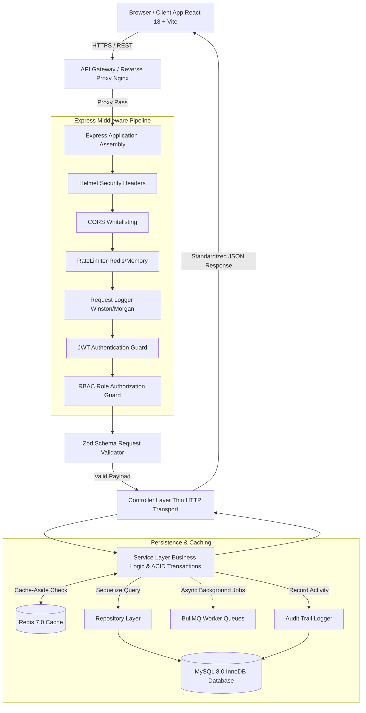
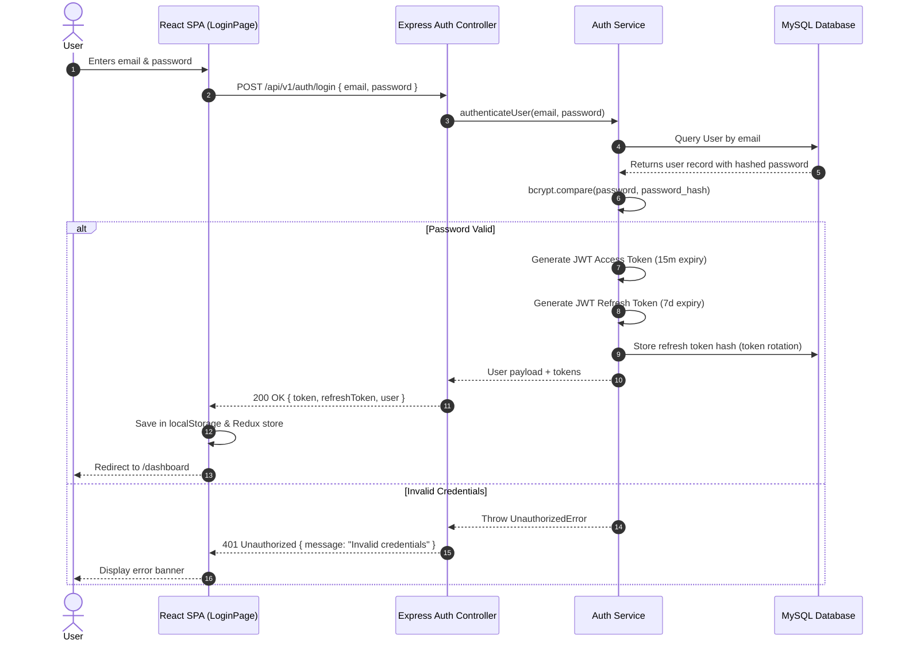
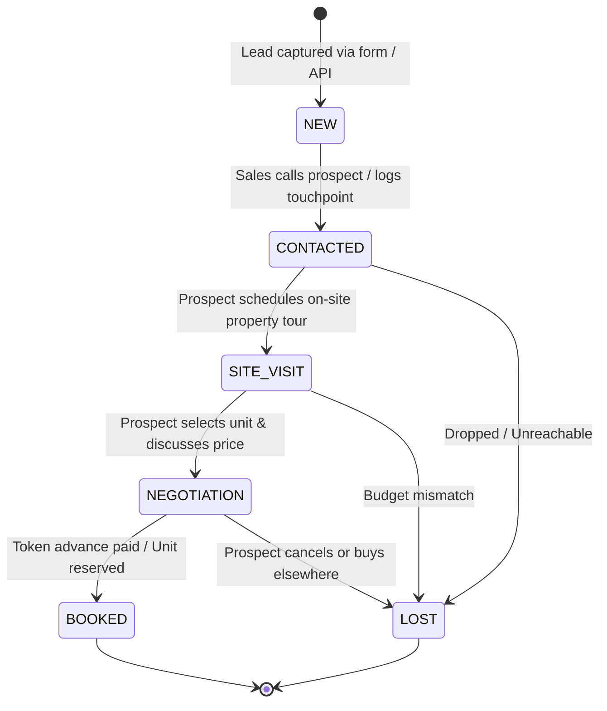
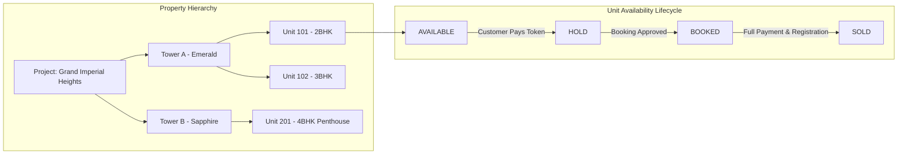
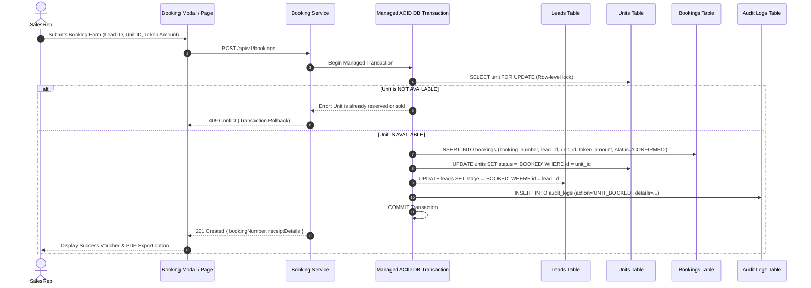
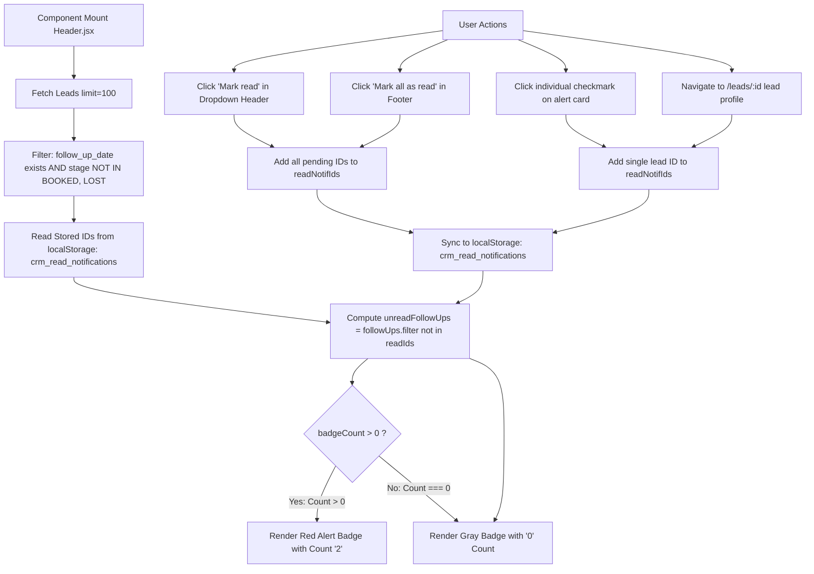
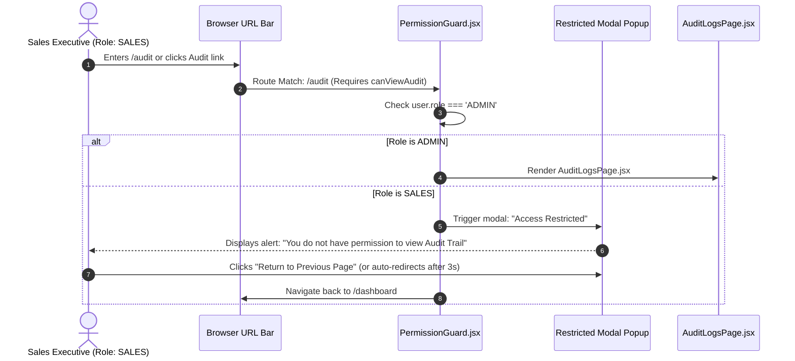

# 🏢 Real Estate CRM – Working Flow & Technology Stack Architecture

> **Complete Technical Guide**: Detailed explanation of system architecture, end-to-end dataflows, business lifecycle workflows, and the complete inventory of tools and libraries powering the platform.

---

## 📑 Table of Contents
1. [Executive Overview](#1-executive-overview)
2. [High-Level Architecture & Layered Flow](#2-high-level-architecture--layered-flow)
3. [End-to-End Business Lifecycle Workflows](#3-end-to-end-business-lifecycle-workflows)
   - [Workflow 1: Authentication & Session Token Lifecycle](#workflow-1-authentication--session-token-lifecycle)
   - [Workflow 2: Lead Acquisition & Pipeline Stage Progression](#workflow-2-lead-acquisition--pipeline-stage-progression)
   - [Workflow 3: Property, Tower & Unit Inventory Lifecycle](#workflow-3-property-tower--unit-inventory-lifecycle)
   - [Workflow 4: Atomic Unit Booking & Transaction Workflow](#workflow-4-atomic-unit-booking--transaction-workflow)
   - [Workflow 5: Follow-up Notification Engine & Read Count State](#workflow-5-follow-up-notification-engine--read-count-state)
   - [Workflow 6: RBAC Authorization & Route Guard Interception](#workflow-6-rbac-authorization--route-guard-interception)
   - [Workflow 7: Centralized Audit Logging Flow](#workflow-7-centralized-audit-logging-flow)
4. [Comprehensive Technology Stack & Tooling Breakdown](#4-comprehensive-technology-stack--tooling-breakdown)
   - [Frontend Ecosystem](#frontend-ecosystem)
   - [Backend Application Ecosystem](#backend-application-ecosystem)
   - [Database, Storage & Caching](#database-storage--caching)
   - [DevOps, Containerization & Orchestration](#devops-containerization--orchestration)
5. [Step-by-Step Data Journey Example](#5-step-by-step-data-journey-example)

---

## 1. Executive Overview

The **Real Estate CRM** is an enterprise sales execution and property inventory platform built for real estate developers, brokerage firms, and high-velocity sales teams.

### Core Value Proposition:
* **Inventory Control**: Live tracking of flats, penthouses, and villas across projects and towers to prevent double-booking.
* **Pipeline Acceleration**: Structured lead progression (`NEW` ➔ `CONTACTED` ➔ `SITE_VISIT` ➔ `NEGOTIATION` ➔ `BOOKED` ➔ `LOST`) with follow-up timers.
* **Role Governance**: Strict separation between Administrator and Sales Representative roles, guarding sensitive audit records and financial logs.
* **Auditability**: Complete audit trails capturing who changed what stage, who reserved which unit, and when transactions took place.

---

## 2. High-Level Architecture & Layered Flow

The application follows the **Clean Architecture** and **Domain-Driven Design (DDD)** pattern. Every request flows sequentially through distinct, decoupled layers:

### Detailed Layer Responsibilities:
1. **Client Layer (`frontend/src/`)**: React 18 SPA styled with Tailwind CSS, consuming REST APIs via an Axios client with automated token rotation interceptors.
2. **Middleware Layer (`backend/src/middlewares/`)**: Security gatekeepers handling helmet headers, CORS, rate limits, token decoding, and role checking.
3. **Validator Layer (`backend/src/validators/`)**: Zod schemas validating request parameters, headers, and body before hitting business logic.
4. **Controller Layer (`backend/src/controllers/`)**: Extracts parameters, calls corresponding service methods, and maps outcomes to standard JSON envelopes (`{ success, message, data }`).
5. **Service Layer (`backend/src/services/`)**: Orchestrates domain transactions, state transitions, business rules, and audit logging.
6. **Repository Layer (`backend/src/repositories/`)**: Abstracted Sequelize ORM query builders performing projection, filtering, and joins.
7. **Database Layer**: Relational MySQL database enforcing foreign-key integrity, cascade policies, and index constraints.

---

## 3. End-to-End Business Lifecycle Workflows

---

### Workflow 1: Authentication & Session Token Lifecycle

---

### Workflow 2: Lead Acquisition & Pipeline Stage Progression

#### What happens on stage change:
1. Sales rep clicks **"Change Stage"** in the lead profile (`/leads/:id`).
2. Frontend sends `PATCH /api/v1/leads/:id/stage` with the new stage value and optional notes.
3. Backend validates that the transition is valid according to the `leadStages.js` state machine.
4. An entry is automatically inserted into `lead_notes` documenting the transition reason.
5. An entry is recorded into `audit_logs` capturing user ID, lead ID, old stage, and new stage.
6. The dashboard sales funnel updates its stage distribution counts immediately.

---

### Workflow 3: Property, Tower & Unit Inventory Lifecycle

* **Unit Addition**: Administrators can launch new units via `AddUnitModal.jsx` specifying floor, BHK, carpet area, base price, and balcony details.
* **Pricing Calculator**: Automatically computes total estimated cost based on `base_price + floor_rise + premium_location_charges`.
* **Live Lock**: Units marked as `BOOKED` or `HOLD` cannot be selected by another sales rep, avoiding conflicts.

---

### Workflow 4: Atomic Unit Booking & Transaction Workflow

When a sales executive books a unit for a lead, the operation is wrapped in a **Sequelize Managed ACID Transaction**:

---

### Workflow 5: Follow-up Notification Engine & Read Count State

---

### Workflow 6: RBAC Authorization & Route Guard Interception

---

### Workflow 7: Centralized Audit Logging Flow

Every critical action in the system generates an audit record automatically:

| Event Trigger | Action Logged | Captured Metadata |
| :--- | :--- | :--- |
| User Login | `USER_LOGIN` | IP Address, User Agent, Timestamp |
| Lead Created | `LEAD_CREATED` | Lead ID, Name, Source, Assigned Rep |
| Stage Progression | `STAGE_CHANGED` | Previous Stage, New Stage, Notes |
| Unit Status Change | `UNIT_STATUS_CHANGED` | Unit ID, Old Status, New Status |
| Booking Confirmed | `BOOKING_CREATED` | Booking ID, Unit Number, Token Advance |
| Role Modification | `ROLE_UPDATED` | Target User ID, Assigned Permissions |

---

## 4. Comprehensive Technology Stack & Tooling Breakdown

### Frontend Ecosystem

| Tool / Library | Version | Purpose in Project | Why Used |
| :--- | :---: | :--- | :--- |
| **React** | `18.3.1` | Core UI Library | Component-based, virtual DOM, concurrent rendering |
| **Vite** | `6.1.0` | Build Tool & Dev Server | Instant Hot Module Replacement (HMR) & Rollup optimization |
| **Tailwind CSS** | `3.4.17` | Styling Engine | Utility-first CSS, custom design tokens, rapid responsive layout |
| **React Router DOM** | `7.2.0` | Client-side Routing | Declarative routing, dynamic parameter matching (`/leads/:id`), route guards |
| **Redux Toolkit** | `2.5.1` | Global State Management | Normalized slices for auth state, user credentials, and notifications |
| **React-Redux** | `9.2.0` | Redux Binding for React | Connects React components to the global Redux store |
| **React Hook Form** | `7.54.2` | Form Management | High-performance uncontrolled forms, minimal re-renders |
| **Zod** | `3.24.2` | Schema Validation | Type-safe client and server input validation |
| **Axios** | `1.7.9` | HTTP Client | Promise-based networking with interceptors for silent JWT refresh |
| **Lucide React** | `0.475.0` | Iconography | Modern, consistent icon library across all CRM views |
| **jspdf** | `4.2.1` | PDF Generation | Client-side export of booking vouchers and payment receipts |
| **html2canvas** | `1.4.1` | DOM to Canvas Snapshot | Captures printable invoice layout for PDF rendering |
| **clsx & tailwind-merge**| `2.1.1` / `3.0.1` | Class Utility | Conditional class merging without CSS specificity conflicts |

---

### Backend Application Ecosystem

| Tool / Library | Version | Purpose in Project | Why Used |
| :--- | :---: | :--- | :--- |
| **Node.js** | `>=18.0.0` | JavaScript Runtime | Non-blocking, event-driven I/O ideal for scalable APIs |
| **Express.js** | `4.21.2` | Web Framework | Minimalist, robust REST API routing and middleware pipeline |
| **Sequelize** | `6.37.5` | Object-Relational Mapping (ORM)| Schema definition, migrations, associations, transactions |
| **mysql2** | `3.12.0` | MySQL Client Driver | High-performance MySQL driver with connection pooling |
| **sqlite3** | `5.1.7` | Embedded SQL Engine | Zero-config local development and testing fallback |
| **Bcryptjs** | `2.4.3` | Password Encryption | 10-round salted hashing protecting user passwords in DB |
| **jsonwebtoken** | `9.0.2` | Authentication Tokens | Stateless authentication using Access and Refresh JWTs |
| **Helmet** | `8.0.0` | Security Headers | Sets `X-Content-Type-Options`, `Frameguard`, `HSTS` headers |
| **CORS** | `2.8.5` | Cross-Origin Policy | Restricts API access to trusted frontend origins |
| **express-rate-limit** | `7.5.0` | Rate Limiting | Protects auth and API endpoints against brute force and DDoS |
| **rate-limit-redis** | `4.2.0` | Distributed Rate Limiting | Stores rate limit hit counters in Redis across server instances |
| **Compression** | `1.8.0` | Response Compression | Compresses JSON responses using Gzip to minimize latency |
| **Morgan** | `1.10.0` | HTTP Request Logging | Logs incoming HTTP methods, URLs, status codes, and response times |
| **Winston** | `3.17.0` | Structured Logger | JSON logging, severity levels, and automated PII redaction |
| **winston-daily-rotate** | `5.0.0` | Log File Management | Daily log file rotation preventing disk space exhaustion |
| **Swagger UI Express** | `5.0.1` | Interactive Documentation | Serves OpenAPI UI at `/api/docs` for API exploration |
| **swagger-jsdoc** | `6.2.8` | JSDoc OpenAPI Generator | Generates OpenAPI specifications directly from route comments |

---

### Database, Storage & Caching

| Tool / Technology | Version | Role in Architecture |
| :--- | :---: | :--- |
| **MySQL** | `8.0` | Primary relational database with InnoDB engine, ACID transactions, and composite indexes |
| **Redis** | `7.0` | In-memory key-value store used for cache-aside reads, rate limiting, and BullMQ queues |
| **ioredis** | `5.5.0` | Robust Redis client with automatic reconnections, clustering, and pipeline support |
| **BullMQ** | `5.41.6` | Distributed background task queue handling email alerts and async notification processing |

---

### DevOps, Containerization & Orchestration

| Tool / Technology | Purpose | Key Details |
| :--- | :--- | :--- |
| **NPM Workspaces** | Monorepo Management | Manages dependencies across root, `backend/`, and `frontend/` in a single command |
| **Concurrently** | Parallel Dev Execution | Runs `npm run dev` for both backend and frontend concurrently in one terminal |
| **Nodemon** | Auto-Restart Dev Daemon | Monitors backend files and automatically restarts Express server on code edits |
| **Docker & Compose** | Container Deployment | Multi-container stack (`docker-compose.yml`) running MySQL, Redis, Backend, and Frontend |
| **Nginx** | Reverse Proxy & Web Server | Serves compiled React production bundle with SPA fallback routing (`try_files $uri /index.html`) |

---

## 5. Step-by-Step Data Journey Example

### Scenario: Sales Executive closes a deal on Unit 102
1. **Lead Selection**: Sales rep opens `/leads/2` (Prospect: *dmeo*).
2. **Notification Auto-Clear**: [Header.jsx](file:///e:/sangili/kosal-Task/frontend/src/components/layout/Header.jsx) detects route `/leads/2`, marks the lead's follow-up as read, and immediately adjusts the notification badge counter (showing `0` if all others are clear).
3. **Unit Selection**: Sales rep clicks **"Book Unit"**, selects *Grand Imperial Heights ➔ Tower A ➔ Unit 102 (3BHK)*.
4. **Validation**: Frontend form enforces positive token advance value via Zod schema.
5. **Atomic Execution**: Backend [booking.service.js](file:///e:/sangili/kosal-Task/backend/src/services/booking.service.js) begins an ACID transaction:
   - Locks Unit 102 (`FOR UPDATE`).
   - Verifies unit status is `AVAILABLE`.
   - Creates booking record #`BK-2026-0004`.
   - Updates Unit 102 status to `BOOKED`.
   - Advances lead *dmeo* stage to `BOOKED`.
   - Records `BOOKING_CREATED` in `audit_logs`.
   - Commits transaction.
6. **Live Dashboard Update**:
   - Total booked revenue increases on `/dashboard`.
   - Conversion funnel increments Booked count.
   - Unit Inventory matrix on `/units` shows Unit 102 badge changed from `AVAILABLE` (green) to `BOOKED` (emerald).
7. **Audit Record**: Admin logging in can inspect the entire operation under `/audit` with timestamps and user identification.
